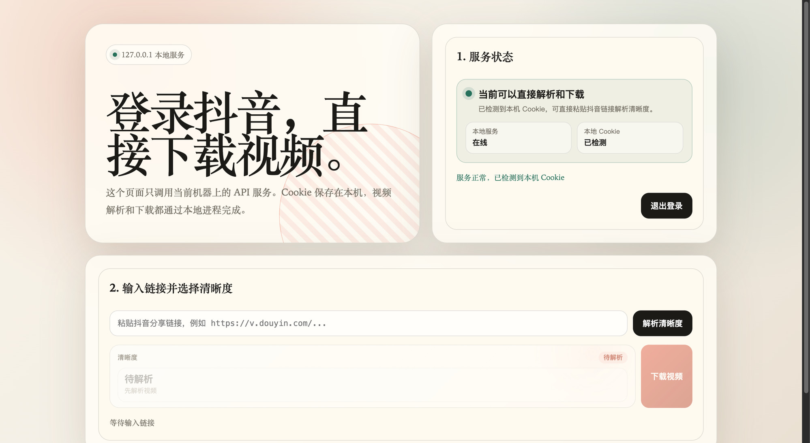
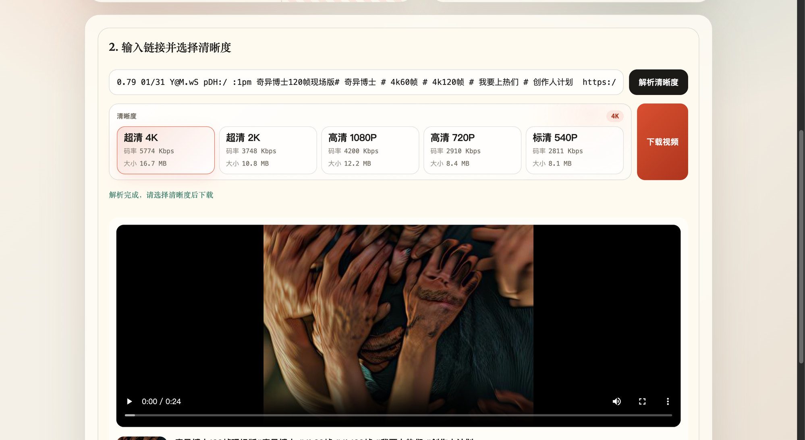

# 抖音本地下载服务

基于 FastAPI 的本地 Web 服务，启动后通过浏览器访问 `web/index.html`，完成抖音扫码登录、视频解析、清晰度选择和下载任务。

## 页面预览





## 功能

- 本地 Web 页面：访问 `http://127.0.0.1:8787/` 使用。
- 扫码登录：通过 Playwright 获取抖音登录二维码，并保存 Cookie。
- 视频解析：解析单条抖音视频信息和可选清晰度。
- 下载任务：异步下载视频，前端轮询进度，完成后保存 MP4 文件。

## 快速开始

macOS / Linux：

```bash
./start.sh
```

Windows：

```bat
start.bat
```

也可以直接运行跨平台启动器：

```bash
python start.py
```

启动后打开：

```text
http://127.0.0.1:8787/
```

可通过环境变量调整监听地址：

```bash
HOST=0.0.0.0 PORT=8787 ./start.sh
```

手动启动方式：

```bash
pip install -r requirements.txt
python -m playwright install chromium
python -m uvicorn api_server:app --host 127.0.0.1 --port 8787
```

## 集成到桌面 exe

`start.sh` / `start.bat` 只用于源码开发环境。最终桌面 `.exe` 不应依赖 shell 脚本常驻后台，而应在主程序启动时调用 `server_runtime.py`。

如果最终 `.exe` 是 Python / PyInstaller，可以在主程序里这样启动本地服务：

```python
from server_runtime import start_background_server, stop_background_server

server_handle = start_background_server(host="127.0.0.1", port=8787)

# 主程序退出时调用
stop_background_server(server_handle)
```

这样 FastAPI 会作为当前进程里的后台线程常驻；主程序退出时再显式关闭。

如果最终 `.exe` 不是 Python 实现，请等价处理：

1. 启动时请求 `http://127.0.0.1:8787/health`。
2. 如果服务不存在，后台拉起打包后的本地服务进程。
3. 等待 `/health` 返回成功。
4. 打开或内嵌 `http://127.0.0.1:8787/`。
5. 主程序退出时关闭该服务进程。

Playwright Chromium 需要随 `.exe` 的安装流程预装或一起打包，否则扫码登录无法创建二维码。

## API

```bash
# 健康检查
curl http://127.0.0.1:8787/health

# 创建扫码登录会话，返回 session_id 和二维码 base64
curl -X POST http://127.0.0.1:8787/auth/session \
  -H 'Content-Type: application/json' \
  -d '{"qr_timeout":30}'

# 查询扫码状态
curl http://127.0.0.1:8787/auth/session/<session_id>

# 解析视频信息和可选清晰度
curl -X POST http://127.0.0.1:8787/parse/video \
  -H 'Content-Type: application/json' \
  -d '{"url":"抖音分享链接","session_id":"<session_id>"}'

# 创建带进度的下载任务
curl -X POST http://127.0.0.1:8787/download/video/task \
  -H 'Content-Type: application/json' \
  -d '{"url":"抖音分享链接","session_id":"<session_id>","quality":"1080p"}'

# 查询下载进度
curl http://127.0.0.1:8787/download/video/task/<task_id>

# 下载完成后获取 mp4 文件
curl -o douyin.mp4 http://127.0.0.1:8787/download/video/task/<task_id>/file
```

## 文件结构

```text
douyin-parse/
├── api_server.py                 # FastAPI 服务入口，托管 Web 页面和 API
├── web/index.html                # 本地 Web 页面
├── docs/                         # README 截图等说明资源
├── services/
│   ├── douyin_login.py           # 扫码登录、Cookie 读写
│   ├── download_service.py       # 视频解析和下载
│   └── download_tasks.py         # 异步下载任务
├── douyin_video_parser.py        # 抖音视频解析核心逻辑
├── abogus.py                     # a_bogus 算法实现
├── xbogus.py                     # X-Bogus 算法实现
├── server_runtime.py             # exe 内嵌/后台启动服务运行时
├── start.py                      # 跨平台源码启动器
├── start.sh                      # macOS/Linux 启动脚本
├── start.bat                     # Windows 启动脚本
├── tests/test_local_api_helpers.py
└── requirements.txt
```

## 本地数据

以下文件或目录由本地运行产生，已在 `.gitignore` 中忽略：

- `config.json`：保存 Cookie 和下载目录配置。
- `douyin_cookie.txt`：旧版本 Cookie 文件。当前版本首次读取后会迁移到 `config.json` 并删除该文件。
- `downloads/`：默认下载目录。
- `__pycache__/`：Python 缓存。

## 常见问题

### 提示“请先调用 /auth/session 扫码登录”

先在页面中创建扫码登录会话并完成登录，或者确认 `config.json` 中已有有效 Cookie。

### 提示“解析失败”

通常是链接无效、Cookie 过期，或当前内容不是视频。当前 Web 页面只支持视频下载，不支持图集下载。

### 无法创建二维码

确认已安装依赖并执行过：

```bash
python -m playwright install chromium
```

## 免责声明

本工具仅供学习交流使用，请勿用于商业用途。下载的视频请遵守相关法律法规和平台规定。
