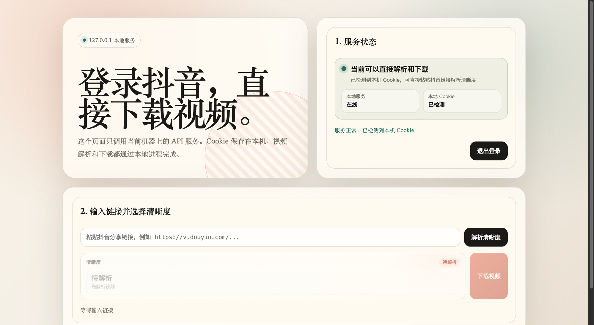
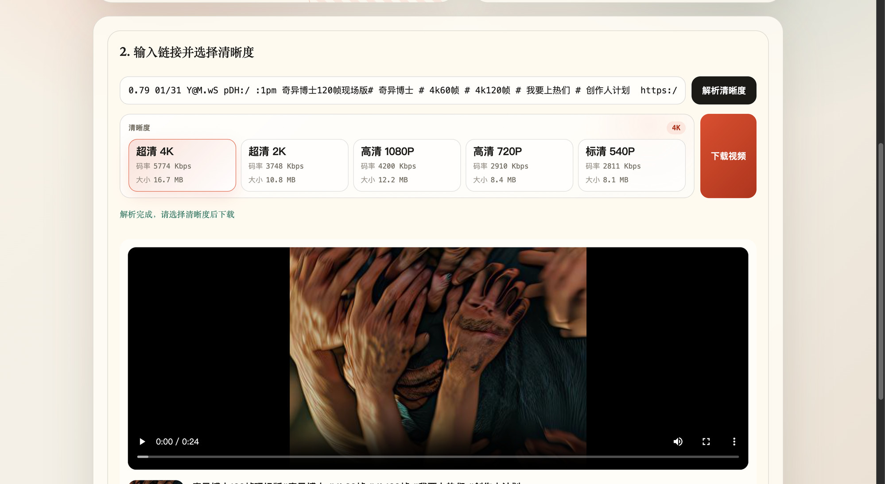

# 抖音视频与文案工具

基于 FastAPI 的本地 Web 工具。扫码登录抖音后，可以下载单条视频，也可以把视频里的声音通过本机 ASR 转成可复制文案。

## 页面预览





## 功能

- 本地 Web 页面：访问 `http://127.0.0.1:8787/` 使用。
- 扫码登录：通过 Playwright 获取抖音登录二维码，并保存 Cookie。
- 视频解析：解析单条抖音视频信息和可选清晰度。
- 下载任务：异步下载视频，前端轮询进度，完成后保存 MP4 文件。
- 字幕解析：使用 `faster-whisper-small`、CPU `int8` 在本机识别视频语音。
- 文案结果：显示真实时间分段，支持复制全文和下载 UTF-8 TXT。
- 双 Tab 页面：“视频下载”和“字幕解析”共用本机 Cookie 与登录状态。
- 结果持久化：字幕清单和 TXT 保存在 `data/transcripts/`，重启后仍可查看。

## 快速开始

macOS / Linux：

```bash
./start.sh
```

Windows：

```bat
start.bat
```

也可以直接运行跨平台启动器：

```bash
python start.py
```

启动后打开：

```text
http://127.0.0.1:8787/
```

可通过环境变量调整监听地址：

```bash
HOST=0.0.0.0 PORT=8787 ./start.sh
```

手动启动方式：

```bash
pip install -r requirements.txt
python -m playwright install chromium
python packaging/windows/download_model.py --destination models/faster-whisper-small
python -m uvicorn api_server:app --host 127.0.0.1 --port 8787
```

字幕模型固定为 `Systran/faster-whisper-small` revision `536b0662742c02347bc0e980a01041f333bce120`。源码模式首次使用字幕解析前必须把模型下载到 `models/faster-whisper-small/`；Windows 绿色版会直接附带模型。

## Windows 绿色版

绿色版采用 PyInstaller `onedir`，附带 Python 运行时、Playwright Chromium 和 small 模型。同事解压后双击 `抖音视频工具.exe`，程序会启动本地服务并打开默认浏览器；关闭控制台窗口即可退出。

Windows 产物必须在 Windows 环境构建。macOS 不能直接生成或验收 Windows EXE。仓库提供手动工作流 `.github/workflows/build-windows-portable.yml`，也可以在 Windows PowerShell 中运行：

```powershell
./packaging/windows/build.ps1 -MinimumVersion "1.1.0"
```

输出：

- `releases/抖音视频工具-v1.1.0-win64.zip`：首次发送的完整绿色版。
- `releases/更新包-v1.1.0.zip`：普通程序核心更新包。

详细构建和验收步骤见 [`docs/windows-release.md`](docs/windows-release.md)。

## 离线一键更新

1. 把 `更新包-vX.Y.Z.zip` 放到绿色版程序根目录。
2. 双击根目录的 `一键更新.bat`。
3. 更新器结束正在运行的工具，校验清单、文件大小和 SHA-256，再替换程序核心。
4. 成功后自动重新启动；失败会恢复 `_rollback/` 中的旧核心。

普通更新不会覆盖 `config.json`、`data/`、`downloads/`、`models/`、`browsers/`、`一键更新.bat` 或 `更新工具.ps1`。

## API

```bash
# 健康检查
curl http://127.0.0.1:8787/health

# 创建扫码登录会话，返回 session_id 和二维码 base64
curl -X POST http://127.0.0.1:8787/auth/session \
  -H 'Content-Type: application/json' \
  -d '{"qr_timeout":30}'

# 查询扫码状态
curl http://127.0.0.1:8787/auth/session/<session_id>

# 解析视频信息和可选清晰度
curl -X POST http://127.0.0.1:8787/parse/video \
  -H 'Content-Type: application/json' \
  -d '{"url":"抖音分享链接","session_id":"<session_id>"}'

# 创建带进度的下载任务
curl -X POST http://127.0.0.1:8787/download/video/task \
  -H 'Content-Type: application/json' \
  -d '{"url":"抖音分享链接","session_id":"<session_id>","quality":"1080p"}'

# 查询下载进度
curl http://127.0.0.1:8787/download/video/task/<task_id>

# 下载完成后获取 mp4 文件
curl -o douyin.mp4 http://127.0.0.1:8787/download/video/task/<task_id>/file

# 创建字幕任务
curl -X POST http://127.0.0.1:8787/transcription/tasks \
  -H 'Content-Type: application/json' \
  -d '{"url":"抖音分享链接","session_id":"<session_id>"}'

# 查询字幕任务详情
curl http://127.0.0.1:8787/transcription/tasks/<task_id>

# 下载 UTF-8 TXT 文案
curl -o transcript.txt http://127.0.0.1:8787/transcription/tasks/<task_id>/text
```

## 文件结构

```text
douyin-parse/
├── api_server.py                 # FastAPI 服务入口，托管 Web 页面和 API
├── web/index.html                # 本地 Web 页面
├── docs/                         # README 截图等说明资源
├── services/
│   ├── douyin_login.py           # 扫码登录、Cookie 读写
│   ├── download_service.py       # 视频解析和下载
│   └── download_tasks.py         # 异步下载任务
│   ├── transcription_service.py  # faster-whisper 模型与语音转写
│   └── transcription_tasks.py    # 单并发队列与字幕持久化
├── douyin_video_parser.py        # 抖音视频解析核心逻辑
├── abogus.py                     # a_bogus 算法实现
├── xbogus.py                     # X-Bogus 算法实现
├── server_runtime.py             # exe 内嵌/后台启动服务运行时
├── desktop_launcher.py           # Windows EXE 启动入口
├── runtime_paths.py              # 源码/绿色版便携路径
├── packaging/                    # Windows 构建、更新与校验脚本
├── start.py                      # 跨平台源码启动器
├── start.sh                      # macOS/Linux 启动脚本
├── start.bat                     # Windows 启动脚本
├── tests/test_local_api_helpers.py
└── requirements.txt
```

## 本地数据

以下文件或目录由本地运行产生，已在 `.gitignore` 中忽略：

- `config.json`：保存 Cookie 和下载目录配置。
- `douyin_cookie.txt`：旧版本 Cookie 文件。当前版本首次读取后会迁移到 `config.json` 并删除该文件。
- `downloads/`：默认下载目录。
- `data/transcripts/`：字幕任务 JSON 清单与 TXT 文案。
- `models/faster-whisper-small/`：本地 ASR 模型。
- `__pycache__/`：Python 缓存。

## 常见问题

### 提示“请先调用 /auth/session 扫码登录”

先在页面中创建扫码登录会话并完成登录，或者确认 `config.json` 中已有有效 Cookie。

### 提示“解析失败”

通常是链接无效、Cookie 过期，或当前内容不是视频。当前 Web 页面只支持视频下载，不支持图集下载。

### 字幕任务提示“ASR 模型不存在”

源码模式执行：

```bash
python packaging/windows/download_model.py --destination models/faster-whisper-small
```

绿色版出现该错误说明发布包不完整，应重新解压完整绿色版；不要用普通更新包代替首次安装包。

### GTX 1050 Ti 为什么没有参与识别

首版针对 i5-10400F 使用 CPU `int8`，以减少 CUDA/cuDNN 体积和驱动兼容问题。程序不承诺固定识别耗时，字幕任务会单并发运行以避免整机过载。

### 无法创建二维码

确认已安装依赖并执行过：

```bash
python -m playwright install chromium
```

## 免责声明

本工具仅供学习交流使用，请勿用于商业用途。下载的视频请遵守相关法律法规和平台规定。
